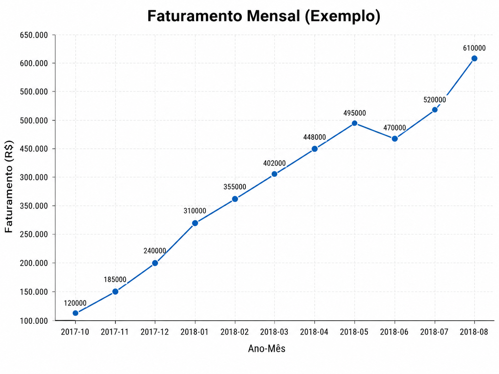
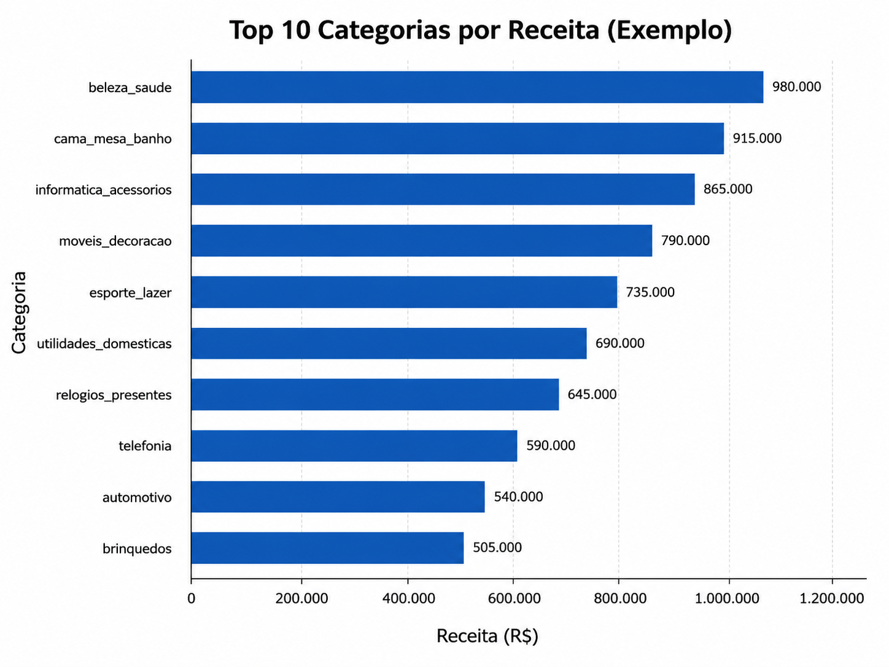
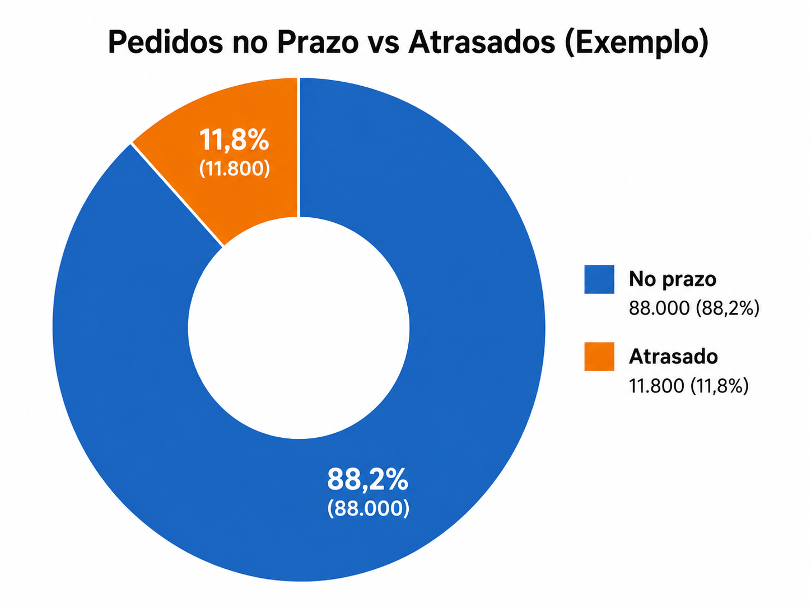
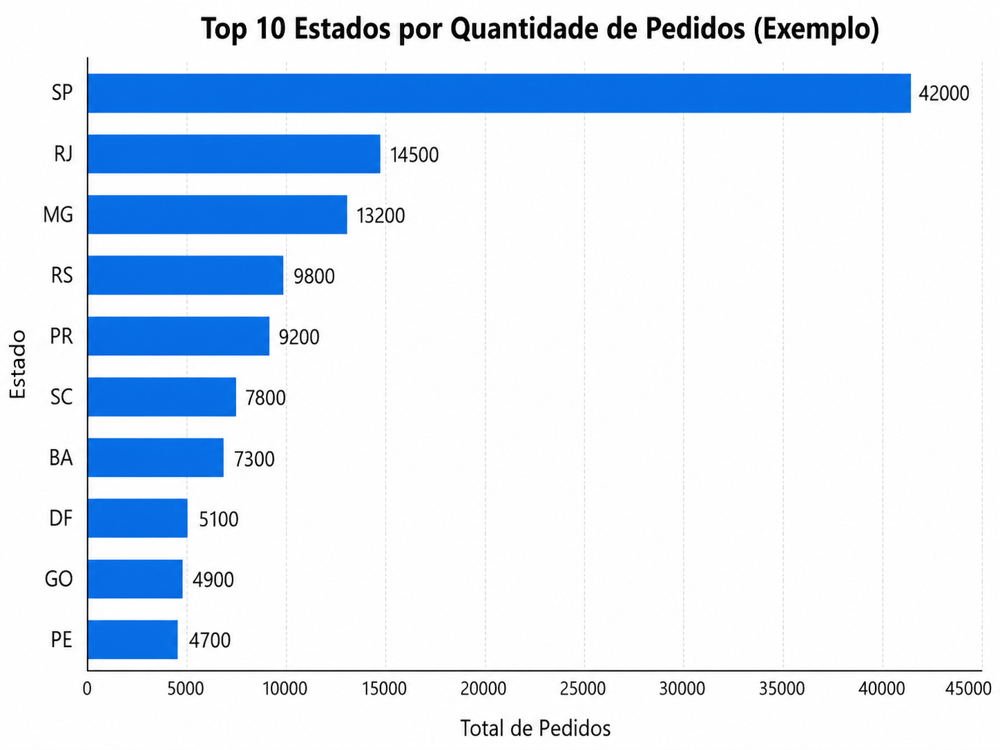

# Olist E-commerce Analytics com SQL

## 📌 Sobre o projeto

Este projeto apresenta uma análise de dados do e-commerce brasileiro **Olist**, utilizando **SQL no PostgreSQL**. O objetivo foi transformar dados relacionais em indicadores de negócio capazes de apoiar decisões sobre vendas, faturamento, categorias de produtos, comportamento regional dos clientes, frete, logística, atrasos nas entregas e satisfação do consumidor.

O projeto foi desenvolvido com foco em portfólio para oportunidades de estágio em dados, demonstrando conhecimentos em **modelagem relacional, tratamento de dados, consultas SQL, criação de views, análise exploratória e geração de insights de negócio**.

---

## 🎯 Objetivo da análise

A análise foi construída para responder perguntas como:

* Como o faturamento evoluiu ao longo do tempo?
* Quais categorias de produtos geram mais receita?
* Quais estados concentram maior volume de pedidos?
* Qual é o percentual de pedidos entregues com atraso?
* Quais estados apresentam maior taxa de atraso?
* O frete deve ser analisado separado do faturamento?
* Existe relação entre atraso na entrega e avaliação do cliente?

---

## 🗂️ Dados utilizados

O dataset utilizado foi o **Brazilian E-Commerce Public Dataset by Olist**, composto por tabelas relacionais com informações de pedidos, clientes, produtos, vendedores, pagamentos, itens vendidos e avaliações.

Principais tabelas utilizadas:

| Tabela                 | Descrição                               |
| ---------------------- | --------------------------------------- |
| `olist_orders`         | Informações dos pedidos, status e datas |
| `olist_order_items`    | Itens vendidos, preço, frete e vendedor |
| `olist_customers`      | Dados dos clientes e localização        |
| `olist_products`       | Produtos e categorias                   |
| `olist_sellers`        | Dados dos vendedores                    |
| `olist_order_payments` | Informações de pagamento                |
| `olist_order_reviews`  | Avaliações dos pedidos                  |

---

## 🧱 Modelagem dos dados

Antes das análises, foi feita a identificação das relações entre as tabelas para evitar erros de duplicidade e garantir consistência nos indicadores.

Principais relacionamentos utilizados:

```text
olist_orders.customer_id → olist_customers.customer_id

olist_orders.order_id → olist_order_items.order_id

olist_order_items.product_id → olist_products.product_id

olist_order_items.seller_id → olist_sellers.seller_id

olist_orders.order_id → olist_order_payments.order_id

olist_orders.order_id → olist_order_reviews.order_id
```

A tabela `olist_order_items` foi utilizada como base principal para métricas de vendas, pois contém os campos `price` e `freight_value`.

---

## 🧹 Tratamento e qualidade dos dados

Antes da análise exploratória, foi realizada uma etapa de validação da qualidade dos dados utilizando SQL.

Foram verificados:

* Quantidade de registros por tabela;
* Valores nulos em colunas importantes;
* Duplicidades em chaves principais;
* Distribuição dos status dos pedidos;
* Datas inconsistentes;
* Preços inválidos;
* Fretes inválidos;
* Produtos sem categoria;
* Pedidos entregues sem data de entrega;
* Pedidos entregues após a data estimada.

Também foram criadas views tratadas para facilitar as análises e evitar repetição excessiva de `JOIN`.

Views criadas:

| View                   | Objetivo                                                                |
| ---------------------- | ----------------------------------------------------------------------- |
| `vw_orders_delivered`  | Pedidos entregues com cálculo de tempo de entrega e atraso              |
| `vw_sales_base`        | Base consolidada de vendas com pedidos, clientes, produtos e vendedores |
| `vw_payments_by_order` | Pagamentos agregados por pedido                                         |
| `vw_reviews_base`      | Avaliações cruzadas com informações logísticas                          |

---

## 🔎 Análise exploratória

A análise exploratória foi feita diretamente em SQL para entender o comportamento geral do dataset antes da construção dos gráficos.

Foram analisados:

* Período disponível na base;
* Volume total de pedidos;
* Quantidade de clientes;
* Quantidade de produtos vendidos;
* Quantidade de vendedores;
* Faturamento total dos produtos;
* Frete total;
* Valor total pago pelo cliente;
* Ticket médio;
* Faturamento mensal;
* Receita por categoria;
* Pedidos por estado;
* Percentual de atraso;
* Tempo médio de entrega;
* Avaliação média por status de entrega.

---

## 📊 Indicadores principais

| Indicador               | Cálculo                                                    |
| ----------------------- | ---------------------------------------------------------- |
| Faturamento de produtos | `SUM(price)`                                               |
| Frete total             | `SUM(freight_value)`                                       |
| Valor total pago        | `SUM(price + freight_value)`                               |
| Total de pedidos        | `COUNT(DISTINCT order_id)`                                 |
| Ticket médio            | `SUM(price) / COUNT(DISTINCT order_id)`                    |
| Tempo médio de entrega  | `order_delivered_customer_date - order_purchase_timestamp` |
| Percentual de atraso    | Pedidos atrasados / pedidos entregues                      |
| Nota média              | `AVG(review_score)`                                        |

---

## 📈 Visualizações

### Faturamento mensal

O faturamento mensal permite acompanhar a evolução das vendas ao longo do tempo, identificando períodos de crescimento, queda ou estabilidade.



---

### Top 10 categorias por receita

A análise por categoria mostra quais segmentos de produtos possuem maior participação no faturamento total.



---

### Top 10 estados por quantidade de pedidos

A análise geográfica permite identificar os estados com maior concentração de demanda.



---

### Pedidos no prazo vs atrasados

A comparação entre data real de entrega e data estimada permite avaliar a eficiência logística da operação.



---

## 📌 Principais insights

### 1. O faturamento precisa ser analisado junto ao volume de pedidos

A evolução mensal do faturamento permite identificar o comportamento das vendas ao longo do tempo. Porém, o faturamento isolado não explica completamente o desempenho do negócio. Por isso, também foram analisados total de pedidos e ticket médio.

**Interpretação:**
Se o faturamento cresce junto com o volume de pedidos, o aumento está relacionado à maior demanda. Se o faturamento cresce sem aumento proporcional de pedidos, pode indicar aumento do ticket médio ou maior venda de produtos mais caros.

---

### 2. Algumas categorias concentram maior parte da receita

A análise por categoria mostra que determinados segmentos possuem maior relevância comercial dentro da plataforma.

**Interpretação:**
Categorias com maior receita devem receber atenção estratégica, pois possuem impacto direto no resultado do e-commerce. Elas podem orientar decisões sobre estoque, campanhas, vendedores e priorização comercial.

---

### 3. A demanda está concentrada em poucos estados

A análise por estado do cliente permite identificar onde estão os principais compradores da plataforma.

**Interpretação:**
Estados com maior quantidade de pedidos representam os mercados mais fortes do e-commerce. Essa informação pode apoiar decisões de marketing regional, expansão e planejamento logístico.

---

### 4. Frete deve ser analisado separadamente do faturamento

O faturamento principal foi calculado pela soma da coluna `price`, enquanto o frete foi analisado separadamente pela coluna `freight_value`.

**Interpretação:**
Separar produto e frete evita distorções no faturamento. O frete representa um componente logístico importante e pode impactar o valor total pago pelo cliente.

---

### 5. Atrasos são indicadores importantes de eficiência operacional

A análise de atraso foi feita comparando a data real de entrega com a data estimada.

**Interpretação:**
Pedidos entregues após a data estimada podem indicar gargalos logísticos, dificuldades regionais ou problemas no prazo informado ao cliente. Esse indicador ajuda a avaliar a qualidade da operação.

---

### 6. Atrasos podem afetar a satisfação do cliente

Ao cruzar o status de entrega com as avaliações, é possível verificar se pedidos atrasados apresentam notas médias menores.

**Interpretação:**
Caso pedidos atrasados tenham avaliação média inferior, isso indica que a logística impacta diretamente a experiência do cliente e deve ser monitorada como parte da estratégia do negócio.

---

## 🧾 Arquivos SQL

O projeto contém scripts SQL separados por etapa:

| Arquivo                             | Descrição                                               |
| ----------------------------------- | ------------------------------------------------------- |
| `02_tratamento_qualidade_dados.sql` | Verificação de qualidade, tratamento e criação de views |
| `03_analise_exploratoria.sql`       | Consultas exploratórias, KPIs e análises de negócio     |

Estrutura sugerida:

```text
sql/
├── 02_tratamento_qualidade_dados.sql
└── 03_analise_exploratoria.sql
```

---

## 🛠️ Tecnologias utilizadas

* PostgreSQL
* SQL
* pgAdmin
* Python
* Plotly
* Pandas
* GitHub
* Modelagem relacional
* Análise exploratória de dados

---

## 📁 Estrutura do repositório

```text
olist-ecommerce-sql-analysis/
│
├── README.md
│
├── sql/
│   ├── 02_tratamento_qualidade_dados.sql
│   └── 03_analise_exploratoria.sql
│
├── images/
│   ├── faturamento_mensal_ao_longo_do_tempo.png
│   ├── top_10_categorias_por_receita.png
│   ├── top_10_estados_por_pedidos.png
│   └── pedidos_no_prazo_e_atrasados.png
│
└── docs/
    └── modelo_relacional.png
```

---

## 🚀 Como executar o projeto

1. Crie um banco de dados PostgreSQL.
2. Importe os arquivos CSV do dataset Olist.
3. Execute o script `02_tratamento_qualidade_dados.sql`.
4. Execute o script `03_analise_exploratoria.sql`.
5. Utilize os resultados das consultas para gerar gráficos em Python, Power BI ou outra ferramenta de visualização.
6. Adicione os gráficos na pasta `images/` para exibição no README.

---

## 🧠 Conclusão

Este projeto mostra como SQL pode ser utilizado para transformar dados brutos de um e-commerce em informações úteis para tomada de decisão.

A análise não se limita apenas ao faturamento. Ela considera também categorias, estados, frete, atrasos e avaliações, permitindo uma visão mais completa do desempenho comercial e operacional da plataforma.

Com isso, o projeto demonstra a importância de integrar análise de vendas, logística e satisfação do cliente para gerar insights relevantes para o negócio.

---


## 🏷️ Tags

`SQL` `PostgreSQL` `Análise de Dados` `Olist` `E-commerce` `Data Analytics` `Modelagem Relacional` `Análise Exploratória` `Portfólio`
